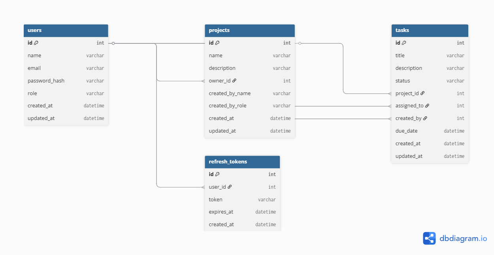
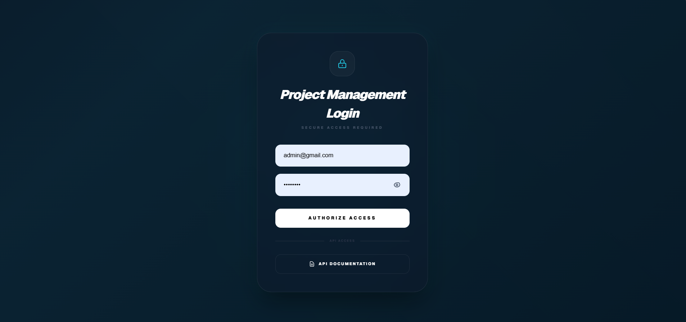
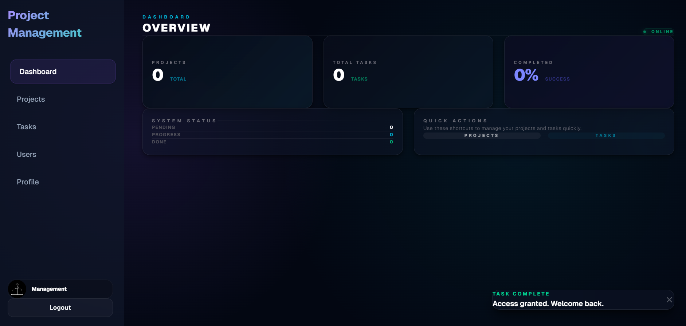
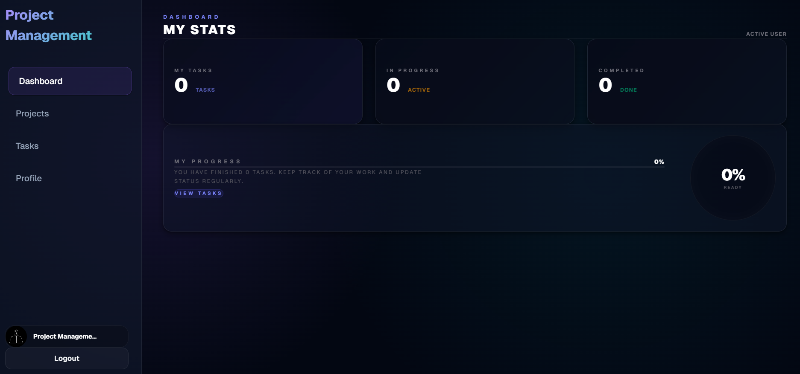
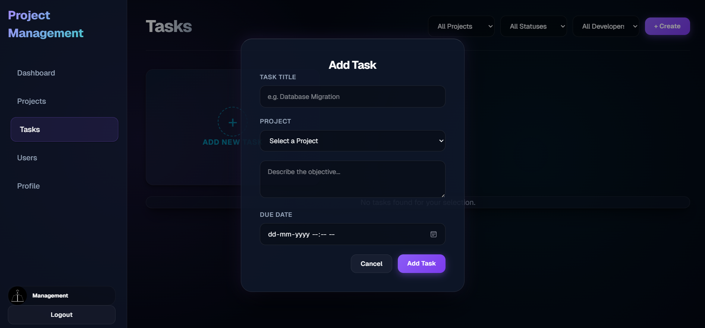
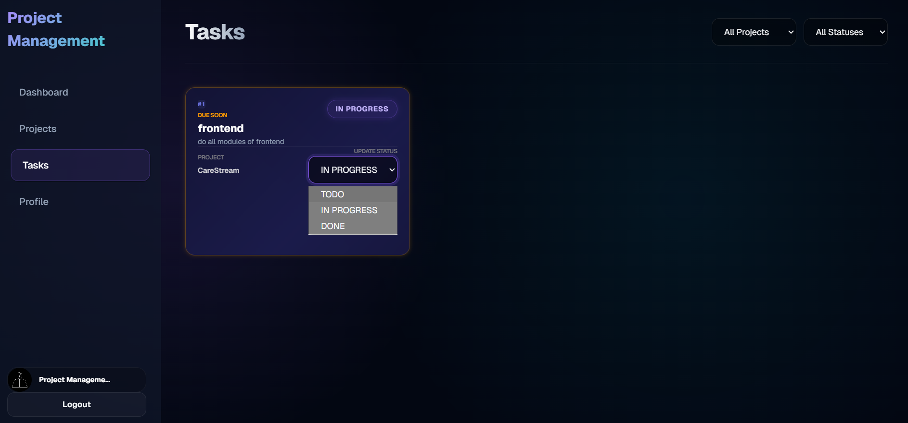
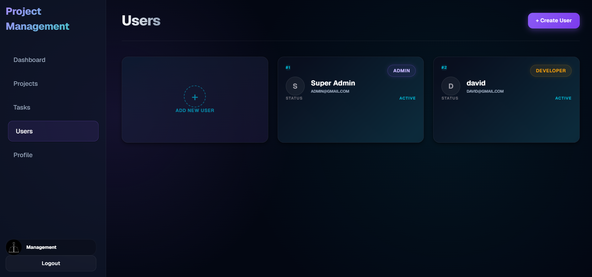
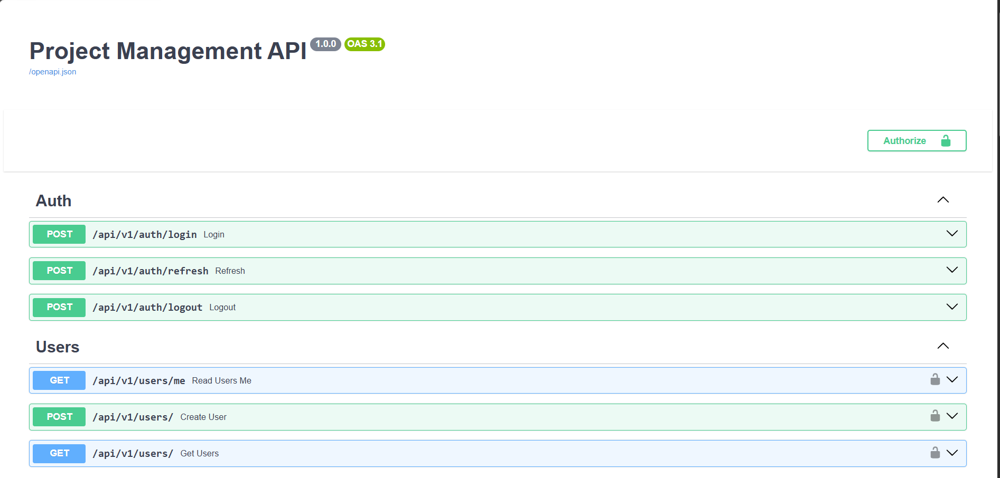

# 🚀 FastAPI Project Management System

A full-stack **Project Management System** built with **FastAPI, PostgreSQL, and Next.js**, featuring secure authentication, role-based access control (RBAC), task assignment with due dates, and a **clean architecture backend**. The entire system is fully containerized using Docker for seamless setup and deployment.

---

## 📌 Overview

This system is designed to help teams manage projects and tasks efficiently with clear role separation:

### 👑 Admin

* Manage users
* Create and manage projects
* Assign tasks with due dates
* Monitor overall system performance

### 👨‍💻 Developer

* View assigned projects
* Work on assigned tasks
* Update task status

---

## 🛠 Tech Stack

### Backend

* FastAPI
* PostgreSQL
* SQLAlchemy
* JWT Authentication (Access + Refresh Tokens)

### Frontend

* Next.js (App Router)
* React
* Tailwind CSS

### DevOps

* Docker & Docker Compose

---

## ✨ Key Features

* 🔐 Secure authentication with JWT (access + refresh tokens)
* 👑 Role-Based Access Control (Admin / Developer)
* 📊 Dashboard with real-time stats
* 📁 Project management system
* ✅ Task management (create, assign, update)
* 📅 Task due date with validation (no past dates)
* 🌍 IST timezone support
* 🔍 Advanced filtering and pagination
* 🚫 Duplicate task prevention per project
* 📘 Interactive API docs (Swagger)
* 🐳 Fully Dockerized (single command setup)
* ⚡ Automatic database setup + admin creation

---

## 🧠 Architecture (Clean Architecture)

The backend follows a **Clean Architecture + Layered Design** ensuring scalability and maintainability.

### 🔹 Layers

```plaintext
API Layer        → FastAPI routes
Service Layer    → Business logic
CRUD Layer       → Database operations
Models Layer     → SQLAlchemy models
Schema Layer     → Pydantic schemas
Core Layer       → Security, config, utilities
```

---

## 📂 Project Structure

```plaintext
backend/app/
│
├── api/           # Routes
├── services/      # Business logic
├── crud/          # DB operations
├── models/        # Database models
├── schemas/       # Request/response schemas
├── core/          # Security & configs
├── db/            # Database setup
```

---

## 🚀 Quick Start (Docker)

### 1️⃣ Clone the repository

```bash
git clone https://github.com/sreenandpk/fastapi-project-management-system.git
cd fastapi-project-management-system
```

---

### 2️⃣ Setup backend environment

```bash
cp backend/.env.docker.example backend/.env.docker
```

👉 Windows:

```powershell
copy backend\.env.docker.example backend\.env.docker
```

---
### 3️⃣ Setup frontend environment
```bash
mv frontend/.env.local.example frontend/.env.local
```
👉 Windows:
```powershell
Rename-Item frontend\.env.local.example frontend\.env.local
```
### 4️⃣ Run the application

```bash
docker-compose up --build
```

---

## 🌐 Access the Application

* Frontend → http://localhost:3000
* Backend → http://localhost:8000
* Swagger Docs → http://localhost:8000/docs

---

## 🔐 Customize Admin Credentials

Before running the project, update admin credentials:

```env
backend/.env.docker
```

```env
ADMIN_EMAIL=your_email@example.com
ADMIN_PASSWORD=your_secure_password
ADMIN_NAME=Your Name
```

👉 Admin is automatically created on startup.

---

## 🗄 Database Design

### 👤 User

* id, name, email, password_hash, role
* Relationships: projects, assigned tasks, created tasks

### 📁 Project

* id, name, description, owner_id
* Contains multiple tasks

### ✅ Task

* id, title, description, status
* project_id, assigned_to, created_by
* due_date (timezone aware)

### 🔐 RefreshToken

* token, user_id, expires_at

---
## 🧩 ER Diagram

The following diagram represents the database structure and relationships:



### Key Relationships

* One **User (Admin)** → can own multiple **Projects**
* One **Project** → contains multiple **Tasks**
* One **Task** → assigned to a **Developer**
* One **Task** → created by an **Admin**
* One **User** → can have multiple **Refresh Tokens**

## 🔗 API Endpoints

### Auth

* POST `/api/v1/auth/login`
* POST `/api/v1/auth/refresh`
* POST `/api/v1/auth/logout`

### Users

* POST `/api/v1/users/`
* GET `/api/v1/users/`

### Projects

* GET `/api/v1/projects/`
* GET `/api/v1/projects/{id}`
* POST `/api/v1/projects/`
* DELETE `/api/v1/projects/{id}`

### Tasks

* GET `/api/v1/tasks/`
* GET `/api/v1/tasks/{id}`
* POST `/api/v1/tasks/`
* PATCH `/api/v1/tasks/{id}/status`
* PATCH `/api/v1/tasks/{id}/assign`

### Dashboard

* GET `/api/v1/dashboard/`

---

## 📬 Postman Collection

A ready-to-use Postman collection is included:

```plaintext
docs/postmanCollection.json
```

### Usage

1. Open Postman
2. Click Import
3. Select the JSON file
4. Start testing APIs

---

## 📸 Screenshots

### 🔐 Login Page



---

### 👑 Admin Dashboard



### 👨‍💻 Developer Dashboard



---

### 📋 Task Management




---

### 👥 User Management



---

### 📘 API Docs (Swagger)



---

## ⚠️ Notes

* Update ports in `docker-compose.yml` if already in use
* `.env` files are excluded from version control for security

---

## 🏆 Future Improvements

* Cloud deployment (AWS / Render / Railway)
* CI/CD pipeline integration
* Email notifications
* Advanced analytics dashboard

---

## 🙌 Author

**Sreenand PK**
Full Stack Developer

GitHub: https://github.com/sreenandpk
